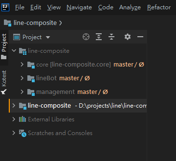

Line Bot Project
======================
## 事前準備
至 Line developer 註冊帳號並建立聊天機器人
* [Line documentation](https://developers.line.biz/zh-hant/docs/messaging-api/building-bot/ "Line 官方文件")

## 開發環境
* OpenJDK 1.8
* Kotlin 1.4
* Spring boot 2.4
* Redis latest
* Gradle latest
* Postman latest
* MariaDB 10.5.8

## 所依賴的 projects
* [Core](https://github.com/a09090443/core "核心專案")

## 專案目錄結構圖

## 各專案說明
* core - 為核心專案，提供各種基本設定
* lineBot - 為 Line bot 後端程式
* management - 暫定為前端程式，尚未開發

## 啟動方式
1. `#cd lineBot`
2. `#gradle bootRun`

## Line 聊天室操作影片
1. line bot + line pay 自動購買流程 
   

2. line bot + line pay 自動購買流程 
   

## 備註
* [Line 官方文件](https://developers.line.biz/zh-hant/docs/messaging-api/)
